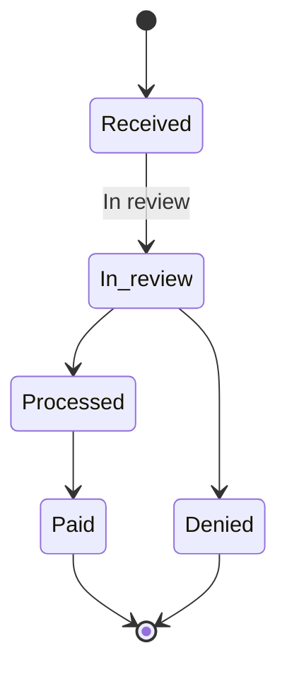

# Claims — domain rules

> Fictional, HIPAA-safe domain notes for the Lamna Health member portal.
> These rules are the source of truth for how the (backlog) Claims feature must
> behave. They align with `docs/claims-api.openapi.yaml` and the `Claim` /
> `ClaimStatus` models that will be added to `lib/types.ts`.

## Statuses

A claim is always in exactly one of five statuses:

| Status       | Meaning                                                        |
| ------------ | -------------------------------------------------------------- |
| `Received`   | Claim has been submitted and logged, not yet reviewed.         |
| `In review`  | Adjudication in progress (eligibility, coding, network check). |
| `Processed`  | Adjudicated; member responsibility and plan payment computed.  |
| `Paid`       | Payment issued to the provider (or reimbursed to the member).  |
| `Denied`     | Claim rejected. Terminal.                                      |

## Lifecycle

The normal (happy-path) progression is linear:

```
Received  →  In review  →  Processed  →  Paid
```

- `Denied` is a **terminal** state and can only be reached **from `In review`**
  (a claim is never denied before it has been reviewed).
- `Paid` is the terminal success state.
- Statuses never move backwards.



## Access control

- **Members only see their own claims.** Every service function is scoped by
  `memberId`; there is no code path that returns another member's claim.
- In the demo, the "signed-in" member is the constant used by
  `lib/members.ts` (`getCurrentMember`). The claims service must filter by that
  member's `id`, exactly as the API contract enforces server-side.
- Lookups by id return **not found** rather than **forbidden** when a claim
  belongs to a different member, so existence is not disclosed.

## Validation

- The claim-lookup input (claim id) must be validated before use. Expected
  format: `CLM-YYYY-NNNN` (see the `pattern` in the OpenAPI contract).
- Reject / ignore anything that does not match; never render raw user input as
  HTML (see `AGENTS.md` conventions and `docs/demo-vulnerability.md`).
